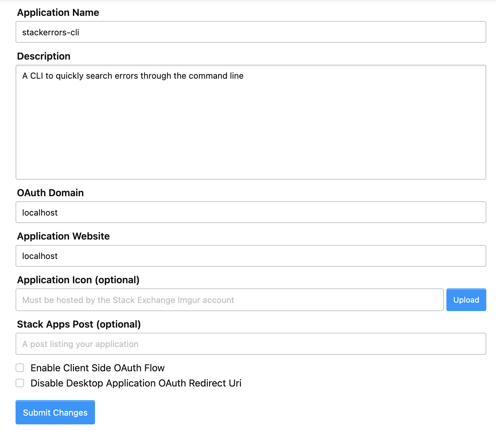

# Welcome to staQ's documentation

## Overview

### What is this project about?

I work with software and thereby, I'm a professional mistake maker. It means that to be able to make things work, I also have to be a professional web surfer on a very specific sphere: [Stackoverflow](https://stackoverflow.com/questions/1732348/regex-match-open-tags-except-xhtml-self-contained-tags/1732454#1732454).

<div style="text-align: center;">


</div>

This website has saved me so many times, even before I had any contact with programming. And now that I'm a Developer this is one of my most used tools.

But sometimes it's just annoying to change windows or workspaces to go to the browser and type whatever I need to search. And the nearest contact with the internet is my beloved terminal.

So... terminal + stackoverflow = GET THIS NASTY ERROR OUT OF MY WAY.

### DISCLAIMER

This package it's still in a development state and it's not ready to be part of the npmjs registry.

### What does this package do?

Basically, you will be able to use StackOverflow's search service from the terminal.
It will return the first 10 title questions that have answers, and those answers will be the top 3 most upvoted.
The CLI is interactive, which means that you will be able to pick a question with your arrow keys and press enter to choose.
After the question has been selected, the CLI returns:

- The body of the question posted by the user
- Top 3 most upvoted answers with their respective links
- If one of the 3 answers is the accepted answer, it will be properly marked as "ACCEPTED ANSWER"
- It returns an error and the help menu if no search argument has been provided

This is not a new concept and has been implemented before by libraries like how2, but I wanted to take a dabble on it and see how far I could go. Spoiler alert: not very far  Who would have thought that displaying a bunch of strings in a black canvas could be so difficult.

But enough of my whinning, lets get you to the setup part so you can try this master piecen't.

### Setup & Installation

#### StackApps key

For this project we will be using StackExchange's API, which is StackOverflow and StackApp's parent company.
StackOverflow's unauthenticated endpoint allows only 300 hits per day, and to bypass this quota issue we will need a key.
This will give us 10,000 hits per IP, per day.
To register a new application, go to https://stackapps.com/apps/oauth/register and register or login with Facebook, Google or email and password.

Fill in the form and set OAuth Domain and Application Website are set to localhost and that Enable Client Side OAuth Flow and Disable Desktop Application OAuth Redirect Uri boxes are not ticked.
Submit your changes and copy or store the generated key because we will need it later.

<div style="text-align: center;">

</div>

#### Installation

Clone the repository

```terminal
git clone https://github.com/pamelazoe/staq.git
```

Run this command to get into the project and install both the CLI and the API

```terminal
cd staq && npm run postinstall
```

Create the .env file with this command and then paste the key we got earlier.
This command will also start the API server.

```terminal
cd API && echo "STACKOVERFLOW_KEY=" > .env && npm start
```

To use this package locally in a development environment we need to link it to our local machine and this will simulate an installed package.
Make sure you are located on the CLI folder to run this command.

```terminal
cd CLI && npm link
```

To remove this package, get into the CLI folder and run

```terminal
npm unlink -g
```

### Usage

```terminal
staq <"Error/Query to search"> [--tags]
```

```terminal
staq "reference error" -t javascript
```

### Stack
